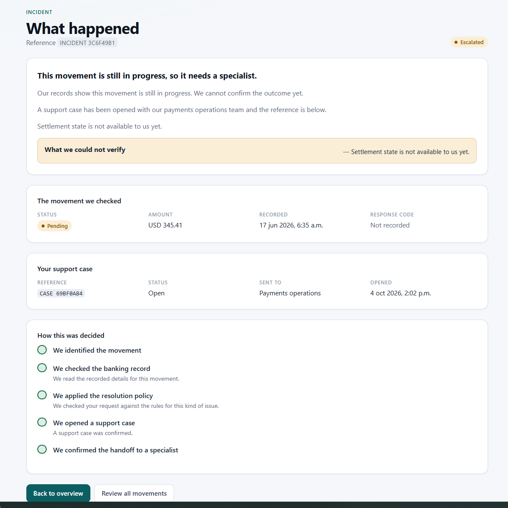
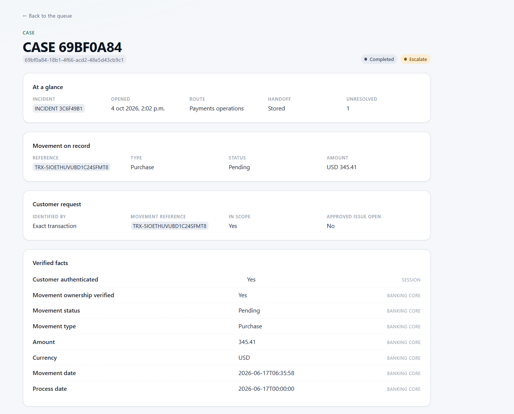
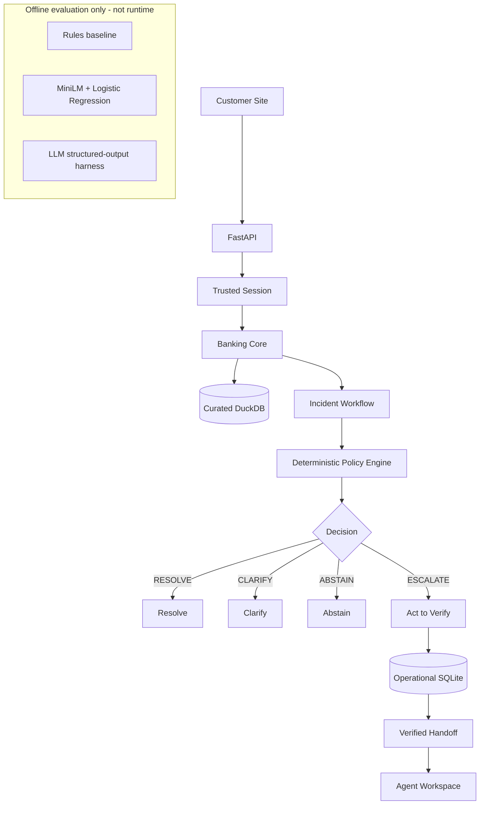

# Code Pump

*Resolve banking incidents when the evidence is sufficient. Escalate with verified context when it isn't.*

Code Pump is a banking incident-resolution prototype that grounds decisions in authorized banking records, applies controlled deterministic policy, verifies actions before reporting success, and hands unresolved cases to specialists with verified context.

**Production demo path:** structured input + Banking Core + deterministic Policy Engine + Incident Workflow.  
**Experimental AI/ML:** evaluated offline only. No learned classifier or LLM is wired into the runtime.

## Product preview

| Customer Resolution Center | Agent Workspace |
|---|---|
|  |  |
| *Verified banking facts, controlled escalation, and confirmed specialist handoff.* | *The same persisted case arrives with verified facts, actions taken, unresolved questions, and audit context.* |

## Automation stops where verified evidence stops

Code Pump can **RESOLVE**, **CLARIFY**, **ESCALATE**, or **ABSTAIN**. It does not infer a banking cause from incomplete evidence, auto-select an ambiguous transaction, or report an action as successful until the system has verified it.

## Evidence at a glance

| Evidence | Result |
|---|---:|
| System safety evaluation | **125 / 125 PASS** |
| Backend tests | **409 passed** |
| Frontend tests | **76 passed** |
| Frozen Challenge v2 | **600 ES/PT examples** |
| Cross-customer leakage observed in evaluated scenarios | **0** |
| Pending escalation latency, local (n=25) | **p50 56.792 ms / p95 111.763 ms** |

*Local/offline prototype measurements; not a production SLA or a guarantee of zero risk. Observed 125/125 PASS does not establish zero production risk.*

## What Code Pump does

**Customer path**

`select/report movement → verified banking facts → policy decision → RESOLVE / CLARIFY / ESCALATE / ABSTAIN`

**Human specialist path**

`verified handoff → facts → evidence → actions taken → unresolved questions → audit timeline`

The customer sees a concise explanation and next step. The specialist receives the persisted evidence and execution history needed to continue the case.

## Architecture



The runtime authority remains outside model-generated prose: identity comes from the trusted session, banking facts come from Banking Core, and policy outcomes come from the deterministic Policy Engine.

## Run the demo

The validated development environment is Windows/PowerShell.

### Backend

From `backend/`:

```powershell
.\.venv\Scripts\python.exe -m uvicorn app.main:app
```

The API runs at `http://127.0.0.1:8000`.

### Frontend

From `frontend/`:

```powershell
npm install
npm run dev
```

Open:

```text
http://localhost:5173
```

### Clean demo state

From the repository root:

```powershell
backend\.venv\Scripts\python.exe -m app.demo status --data-root data
backend\.venv\Scripts\python.exe -m app.demo reset --data-root data
```

`reset` clears only application-generated operational state. It does not modify raw organizer data or `data/processed/banking.duckdb`.

### Deterministic demo scenarios

| Demo | Scenario | Expected outcome |
|---|---|---|
| A | Declined movement | **RESOLVE** |
| B | Pending movement | **ESCALATE** |
| C | Reversed movement | **ESCALATE** |
| D | Ambiguous movement | **CLARIFY** |

Approved + unresolved is also supported as an escalation path; Approved with no supported incident abstains.

> A fresh environment also requires the repository's backend dependencies and local organizer-provided synthetic banking data. See the project configuration and data pipeline code for the exact environment contracts; raw banking records are intentionally not committed to Git.

## Data-backed problem

### Observed data evidence

Code Pump uses **organizer-provided synthetic banking data locally**. Raw and curated banking records are intentionally excluded from Git. The public repository contains the reproducible pipeline, schema contracts, quality checks, aggregate findings, and de-identified evaluation artifacts.

The available transaction data supports deterministic investigation of states such as Declined, Pending, Reversed, and Approved, together with missing evidence and ambiguity. The repository does **not** establish quantified contact-center demand or complaint frequency from the supplied data, so Code Pump does not claim that it does.

### Workflow design judgment

Transaction/payment incidents were selected because they force the system to solve the hard parts of banking service automation: identity-scoped reads, ownership checks, grounding, ambiguity, explicit uncertainty, policy-controlled action, and verified human escalation.

## Safety model

- **Session-derived identity:** customer identity comes from the trusted session, not request-supplied customer IDs.
- **Customer isolation:** banking reads are authorization-scoped; foreign and absent transactions collapse to the same approved semantics to reduce enumeration risk.
- **Strict contracts:** request models reject unknown fields and invalid domain values.
- **Deterministic policy:** banking outcomes are enforced outside model prose; unknown statuses escalate.
- **No unsupported cause inference:** balances and response codes are not interpreted as decline causes.
- **Act → Verify:** an escalation is reported successful only after the support case is written and read back successfully.
- **Separate agent boundary:** the Agent Workspace uses a separate credential space and is read-only.
- **PII minimization:** curated and operational artifacts avoid unnecessary identity data; audit records use stable safe identifiers/fingerprints.
- **Safe failure behavior:** missing evidence and tool failures do not become fabricated banking facts.
- **No chain-of-thought exposure:** explanations are based on facts, policy metadata, and execution records.

## Data engineering

- Raw → staging/temp → curated DuckDB with explicit contracts and column allowlists.
- Quality checks run before the curated projection removes fields.
- No silent row dropping or imputation to make quality checks pass.
- PII-minimized curated projection.
- Referential/data-quality checks and reproducible reruns.
- Full-refresh pipeline today; no streaming or incremental ingestion is claimed.
- `quality_report.json` is generated locally under processed data and is not committed.

A production system would need an explicit refresh cadence, freshness SLOs, backpressure/error handling, and durable lineage/monitoring.

## ML / language-understanding evaluation

The learned component was treated as an experiment, not as a feature to ship.

1. A deterministic ES/PT keyword baseline looked strong on the first synthetic benchmark.
2. Error analysis showed that v1 materially favored literal lexical cues.
3. A harder, separately versioned **Challenge Set v2** was built and frozen before evaluating the frozen systems.
4. Challenge v2 contains **600 examples**, Spanish and Portuguese, **100 per class**, with semantic-family/tier controls to reduce leakage.
5. Neither system met the integration bar, so neither entered the runtime.

| System | Accuracy | Macro-F1 | Coverage |
|---|---:|---:|---:|
| Deterministic baseline | 0.248 | 0.308 | 0.328 |
| MiniLM + Logistic Regression (raw) | 0.582 | 0.591 | 1.000 |
| MiniLM + LR @ 0.7 | 0.247 | 0.361 | 0.287 |

The learned raw classifier generalized better than the baseline on the harder set, but 58.2% accuracy was not sufficient for a banking incident-understanding component. The thresholded configuration abstained too often.

Detailed provenance, frozen artifacts, hashes, and reports are indexed in [`evaluation/README.md`](evaluation/README.md).

## LLM evaluation status

Phase 4B-1 prepared a structured-output LLM evaluation harness with the prompt, schema, and quality gate frozen before execution.

The external benchmark was **not executed because API credits were unavailable**. That infrastructure/billing failure was not scored as model-quality failure, and no LLM was promoted. The production/demo runtime remains independent of `OPENAI_API_KEY`.

See [`evaluation/README.md`](evaluation/README.md) for the recorded execution status and artifact provenance.

## System evaluation

Phase 6 evaluates the implemented system as an adversarial/reliability target rather than only exercising the happy path.

- **125 cases**
- **125 PASS**
- **0 FAIL**
- **0 SKIP** after fixes
- Coverage includes authentication, cross-customer authorization, customer/agent boundaries, malformed input, ambiguity, policy precedence, grounding, missing evidence, tool/data failures, Act → Verify, persistence, handoff quality, audit, PII/secrets, API robustness, frontend safety, and adversarial request boundaries.

The evaluation discovered one **MEDIUM** defect: unknown `CandidateFilters` keys could be silently dropped and widen a search. The input contract was tightened and regression coverage was added.

*Observed 125/125 PASS does not establish zero production risk.*

Detailed cases and reports live under [`evaluation/system/`](evaluation/system/).

## Performance

Local prototype measurements after warm-up, **n=25 per representative operation**:

| Operation | p50 | p95 |
|---|---:|---:|
| Declined resolution | 37.192 ms | 46.963 ms |
| Pending escalation | 56.792 ms | 111.763 ms |
| Agent case-detail read | 3.911 ms | 4.218 ms |

These are local measurements, not a production SLA.

## Cost

The current demo/runtime path is local and deterministic, so it incurs **no external model inference charge per incident**.

That is not the same as zero production cost. Infrastructure, hosting, observability, operations, and workforce costs were not measured. External LLM evaluation cost was not observed because the benchmark did not execute. Cost per successful automated resolution is therefore not defined from current evidence.

## Prototype → production

The right-hand column below is a **proposed production path**, not functionality already implemented.

| Prototype today | Production path |
|---|---|
| React/Vite local | Static hosting / CDN |
| FastAPI local | Containerized API service |
| DuckDB | Managed analytical/data layer |
| SQLite operational store | Managed transactional database / PostgreSQL |
| Trusted demo sessions | Production IAM / SSO |
| Local secret handling | Managed secret store |
| Local audit/events | Centralized logs, tracing, metrics, and durable audit storage |
| Synthetic prototype policy | Bank-approved, versioned policy service |
| Local safety evaluation | CI/CD quality and safety gates |

**Current state:** validated local prototype.  
**Cloud:** not currently deployed. Cloud deployment is optional based on organizer clarification; the repository instead documents the work required to operate the prototype responsibly.

### Route to operation

- **Observability:** current audit/workflow events provide execution evidence; production needs centralized structured logs, metrics, traces, alerting, and durable audit storage.
- **Reliability:** current workflow fails safely and verifies actions; transient production dependencies would need bounded retries, timeouts, idempotency, and service-level fallbacks.
- **Security:** demo sessions enforce boundaries locally; production needs real identity, RBAC, secure session issuance, secret management, and platform controls.
- **Data retention:** no formal production retention/deletion/archival policy is implemented.
- **Capacity:** DuckDB + SQLite are prototype choices; no production load/capacity test has been performed.
- **Freshness:** ingestion is full-refresh; production cadence and freshness requirements remain to be defined.
- **Language:** ES/PT were evaluated experimentally; no natural-language classifier is integrated into runtime.

## Limitations

- The policy is **synthetic prototype policy**, not an approved bank, settlement, or regulatory policy.
- The prototype uses trusted demo sessions rather than production workforce/customer identity infrastructure.
- No production monitoring, SLA, capacity test, retention policy, or cloud deployment is implemented.
- Local DuckDB/SQLite are prototype storage choices.
- The data pipeline is full-refresh.
- The available data does not establish quantified contact-center demand.
- ES/PT language understanding was evaluated offline but not promoted to runtime.
- The external LLM benchmark was not executed because API credits were unavailable.
- Performance evidence is local and small-sample.

## How Code Pump addresses the challenge

- **Data-backed problem:** uses organizer-provided synthetic banking data locally while keeping raw/curated records out of Git; workflow-selection claims are separated from observed evidence.
- **Functioning system:** customer UI, Banking Core, Policy Engine, Incident Workflow, Act → Verify, operational persistence, verified handoff, and Agent Workspace operate end to end.
- **Controlled automation:** authorization and policy live outside model prose; the system resolves, clarifies, escalates, or abstains explicitly.
- **Data/ML rigor:** reproducible preparation, contracts, quality checks, leakage-aware evaluation, frozen Challenge v2, and documented negative results.
- **Measured failures:** held-out ML challenge plus a 125-case system safety/robustness evaluation, including a real defect found and fixed.
- **Route to operation:** explicit gaps and proposed production controls for observability, reliability, security, retention, capacity, freshness, and identity.

## Reproducibility

### Backend quality gates

From `backend/`:

```powershell
.\.venv\Scripts\python.exe -m pytest
.\.venv\Scripts\python.exe -m pytest -W error
.\.venv\Scripts\ruff.exe check .
.\.venv\Scripts\ruff.exe format --check .
```

### Frontend quality gates

From `frontend/`:

```powershell
npm test
npm run typecheck
npm run build
```

### System evaluation

From the repository root:

```powershell
backend\.venv\Scripts\python.exe evaluation\system\run_evaluation.py
```

The committed baseline is **125 / 125 PASS**. Re-running the evaluation can update local timing/timestamp fields; structural verdicts are the relevant regression signal.

## Evaluation artifacts

See [`evaluation/README.md`](evaluation/README.md) for the evidence map.

- [`evaluation/incident_understanding/`](evaluation/incident_understanding/) — Phase 4A v1 and methodology.
- [`evaluation/incident_understanding_v2/`](evaluation/incident_understanding_v2/) — frozen Challenge v2.
- [`evaluation/incident_understanding_llm/`](evaluation/incident_understanding_llm/) — Phase 4B-1 harness and closed-without-results status.
- [`evaluation/system/`](evaluation/system/) — 125-case system evaluation.

Frozen evaluation artifacts are hash-verified in their respective reports; full hashes are intentionally kept out of this overview.

## Repository map

```text
backend/app/data/       data pipeline, contracts, quality
backend/app/banking/    authorized read-only banking core
backend/app/policy/     deterministic synthetic policy
backend/app/workflow/   incident orchestration and Act → Verify
backend/app/api/        FastAPI boundaries
backend/app/demo/       deterministic demo maintenance
backend/app/agent/      read-only specialist workspace
backend/app/ml/         experimental language-understanding components
frontend/               Customer Site + Agent Workspace
evaluation/             ML/LLM/system evaluation evidence
scripts/                reproducible project utilities
```

## Dependency / environment notes

- Python: `>=3.11,<3.13`
- Runtime backend dependencies: DuckDB, FastAPI, Pydantic Settings, Uvicorn.
- Dev/evaluation dependencies include pytest, Ruff, sentence-transformers, scikit-learn, and the repository's existing `httpx2` dependency.
- OpenAI is optional and evaluation-only; it is not imported by the runtime.
- Frontend: React + TypeScript + Vite.